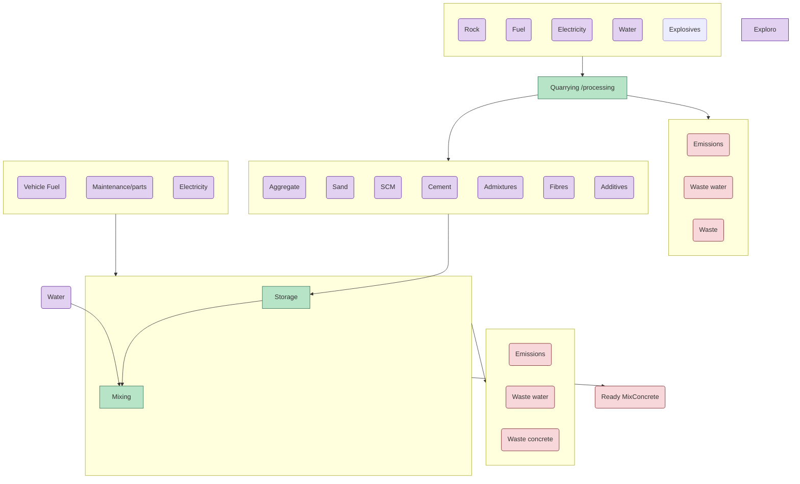
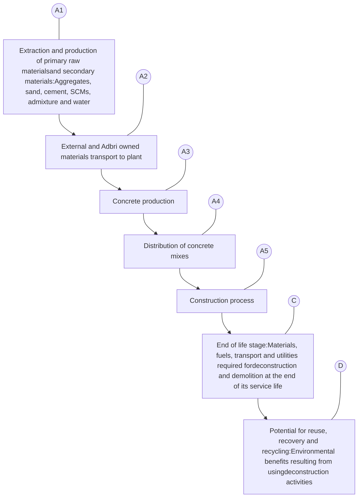

Life Cycle Assessment
& Environmental Product Declaration

# Adbri Concrete EPD—SN252F100 South Australia

**Programme**: The International EPD® System, www.environdec.com
**Programme operator**: EPD International AB
**Regional programme**: EPD Australasia Ltd
**EPD registration number**: EPD-IES-0021165
**Publication Date**: 13-03-2025 | **Version Date**: 13-03-2025 | **Valid until**: 13-03-2030
**Geographical scope**: Australia

In accordance with ISO 14025:2016, EN15804+A2:2019

EPD Australasia International EPD System logo ECO PLATFORM EPD VERIFIED logo

International EPD System logo

An EPD should provide current information and may be updated if conditions change. The stated validity is therefore subject to the continued registration and publication at www.environdec.com.

Photograph of an Adbri Concrete Mack truck in a rural setting

ADBRI Building Australia since 1882 logo

ADBRI Concrete logo

# Table of contents

1.  **About Adbri** page 3
2.  **General Guidance** page 8
3.  **General Information** page 9
4.  **Life Cycle Assessment Information** page 17
5.  **Content Declaration** page 22
6.  **Environmental Performance Results** page 29
7.  **Interpretation of Results** page 37
8.  **References** page 39

# Adbri is *Building a Better Australia* with its locally manufactured cement, lime, concrete, aggregates, industrial minerals and concrete products.

<page_number>2</page_number>

Adbri Concrete EPD

1

# About Adbri

We believe in doing business responsibly; keeping our people and communities safe; meeting the needs of our customers; and creating long-term value for our shareholders.

**We contribute to a sustainable future.**

Since our origins in 1882, we have focused on building long-term partnerships that add value. We are a proud Australian company with an extensive local manufacturing presence which allows us to be agile in meeting customer needs.

At Adbri, we are Always Ready to partner with customers that are building Australia. Photograph of a worker in high-visibility gear and a hard hat.

Adbri Concrete EPD <page_number>3</page_number>

# A proud Australian manufacturer and supplier

As one of Australia’s most experienced construction materials companies, we have helped build the foundations of our communities.

Today our 1500+ strong team located across 200 locations, continue to work closely with our customers, partners and communities to develop solutions that enhance the quality of lives of Australians.

**We were the first Australasian laboratory to commission a robotic quality control cement testing facility which improves testing accuracy and efficiencies.**

## Technical expertise you can rely on.

Our customers are also supported by a national team of in-field technical specialists who work closely with our laboratory-based experts. All our laboratories have achieved ISO 9001 endorsement for Quality Management Systems and our centralised Birkenhead laboratory is also NATA accredited to ISO/IEC 17025 for a range of cementitious, lime, concrete and aggregate test methods.

We are committed to supplying innovative and quality products, supported by our leading technical advice. Our in-house technical experts are highly experienced in developing and managing quality control and assurance systems for our industry. Adbri operates a centralised laboratory complex in Birkenhead (South Australia) that provides leading capability in the Australian heavy construction materials industry.

<page_number>4</page_number> Adbri Concrete EPD

Aerial photograph of an active quarry site showing large piles of gravel and stone, heavy machinery including excavators and haul trucks, a parking area with several vehicles, and site office buildings.

<page_number>5</page_number>

# Sustainability at Adbri

## Contributing to a safe, healthy and sustainable future for Australians, our communities and the environment is a fundamental part of Adbri’s culture.

Our sustainability approach is built on strong relationships with our people, customers, suppliers, partners, shareholders and the communities in which we operate, coupled with continuous improvement across our value chains.

Cement, lime, concrete, aggregates, and masonry are essential materials to the global economy. Our products will play a critical role in the transition to a lower carbon environment, supplying key industries including construction, infrastructure, energy, mining, and agriculture.

**Our goal at Adbri is to be net zero emissions by 2050.**

## Refuse Derived Fuel

At our Adelaide Brighton cement plant where we manufacture clinker, Adbri pioneered in the use of refuse derived fuel (RDF) in Australia in 2003. Since then, we’ve used over 1.3 million tonnes of RDF which has significantly reduced the Group’s GHG emissions and reduced our GWP in states where the use of ABC cement is used.

We operate two emissions-intensive and hard-to-abate processes – the integrated manufacture of clinker and lime production. Our key decarbonisation challenge is associated with unavoidable process emissions that are chemically liberated from the high-temperature processing of limestone, which accounts for approximately 60% of Adbri’s Scope 1 and Scope 2 greenhouse gas emissions.

RDF is produced by a third party who processes industrial waste products to produce an alternative fuel source. As well as reducing demand for fossil fuels, it diverts waste from landfill.

In 2022 we released our Net Zero Emissions Roadmap which sets out the steps we will take to achieve our goal of net zero emissions by 2050, based on the three key actions of reducing emissions, creating new lower carbon products, and collaborating with key partners.

Photograph of hands holding shredded refuse derived fuel

<page_number>6</page_number> Adbri Concrete EPD

Photograph of a worker in safety gear pouring liquid into a graduated cylinder outdoors

## Our Environmental Product Declarations

Adbri is committed to a sustainable future and this includes providing transparency about our products’ environmental credentials via an Environmental Product Declaration (EPD).

<table>
  <thead>
    <tr>
        <th>Version No.</th>
        <th>Version Date</th>
        <th>Summary</th>
    </tr>
  </thead>
  <tbody>
    <tr>
        <td>1</td>
        <td>13-03-2025</td>
        <td>RAA Building Project with Feltrin A &amp; Son</td>
    </tr>
  </tbody>
</table>

Underpinning our EPDs is a Life Cycle Assessment (LCA) which identifies the environmental footprint throughout the life cycle of a product and is compliant with the ISO standards 14040 and 14044.

Having an EPD allows Adbri to understand the roles and contributions of different materials to the total environmental impacts, thus, meeting market demand for science-based, transparent, and verified environmental product information.

This report presents the methodology, data, results, and interpretation of the LCA. The LCA has been through several iterations of internal review to refine the life cycle data and assumptions.

Adbri Concrete EPD <page_number>7</page_number>

2

# General guidance

EPDs are independently verified documents that include information about the environmental impact of products throughout their life cycle.

EPDs require the completion of a Life Cycle Inventory (LCI), LCA and verification to best practice international and Australian standards.

— LCI is the collection of data on the inputs, processes and outputs within a defined system boundary.

— LCA is the modelling of LCI in accordance with ISO 14040, 14044 and 14025 standards.

— EN 15804+A2:2019: Sustainability of construction works – Environmental Product Declarations – core rules for the product category of construction products.

— General Programme Instructions (GPI) for the International EPD System V5.0 – containing instructions regarding methodology and the content that must be included in EPDs registered under the International EPD System.

— Third party verification of the output of the LCA in the format of an EPD.

— Product Category Rules (PCR) 2019:14, v1.3.4 – construction products.

— Instructions of EPD Australasia v4.2 – a regional annex to the general programme instructions of the International EPD System.

## EPDs are not always comparable

When comparing EPDs it is important to recognise:

— EPDs within the same product category from different programmes may not be comparable.

— EPDs of construction products may not be comparable if they do not comply with ISO 14025:2006 or if they are produced using different PCRs.

— Understanding the detail is important in comparisons. Expert analysis is required to ensure data is truly comparable to avoid unintended distortions.

## Benefits of using this EPD

Results derived from this EPD can be used as a component for customers, for the purpose of compiling their own LCA calculation and modelling for EPDs. The environmental impact indicators align with EN15804 +A2 and are used to support lower carbon concrete initiatives, and to establish the global warming potential of materials used for material selection or decision making.

<page_number>8</page_number>

# General information

<page_number>3</page_number>

<table>
  <thead>
    <tr>
        <th colspan="2">Programme Information</th>
    </tr>
  </thead>
  <tbody>
    <tr>
        <td>Programme Operator</td>
        <td>EPD International AB</td>
    </tr>
    <tr>
        <td>Address</td>
        <td>EPD International AB Box 210 60, SE-100 31 Stockholm, Sweden</td>
    </tr>
    <tr>
        <td>E-mail</td>
        <td>info@environdec.com</td>
    </tr>
    <tr>
        <td>Regional programme</td>
        <td>EPD Australasia</td>
    </tr>
    <tr>
        <td>Address</td>
        <td>EPD Australasia Limited 315a Hardy Street Nelson 7010 New Zealand</td>
    </tr>
    <tr>
        <td>Phone</td>
        <td>AU: (+61) 02 8005 8206    NZ: +64 9 889 2909</td>
    </tr>
    <tr>
        <td>Website</td>
        <td>www.epd-australasia.com</td>
    </tr>
    <tr>
        <td>E-mail</td>
        <td>info@epd-australasia.com</td>
    </tr>
    <tr>
        <td>CEN standard</td>
        <td>EN 15804 +A2:2019 serves as the core PCR</td>
    </tr>
    <tr>
        <td>Product category rules (PCR) 2019</td>
        <td>Product Category Rules (PCR) 2019:14 Construction products, Version 1.3.4 Complementary Product Category Rules (C-PCR) 003 to PCR 2019:14 Concrete and concrete elements (EN 16757), Version 2019-12-20 Product Group Classification: UN CPC 375</td>
    </tr>
    <tr>
        <td>PCR review was conducted by</td>
        <td><em>The Technical Committee of the International EPD ® System.</em> <em>Chair: Claudia A. Peña. Contact via</em> info@environdec.com</td>
    </tr>
    <tr>
        <td>Independent third-party verification</td>
        <td>Independent third-party verification of the declaration and data, according to ISO 14025:2006: [x] EPD process certification [ ] EPD verification</td>
    </tr>
    <tr>
        <td>Process certified by</td>
        <td>Epsten Group 101 Marietta St. NW, Suite 2600, Atlanta, Georgia 30303, USA www.epstengroup.com epstengroup Environmental Product Declaration logo Accredited by: A2LA, Certificate #3142.03</td>
    </tr>
    <tr>
        <td>Procedure for follow-up</td>
        <td>Procedure for follow-up of data during EPD validity involves third party verifier: [ ] Yes [x] No</td>
    </tr>
    <tr>
        <td>EPD Prepared by</td>
        <td>Jonas Bengtsson, Pasindu Samarakkody and Weiqi Xing Edge Environment Pty Limited Level 3 Greenhouse, 180 George Street, Sydney NSW 2000 Australia W: www.edgeimpact.global E: info@edgeimpact.global, info@edgeimpact.global edge impact logo</td>
    </tr>
  </tbody>
</table>

The EPD owner has the sole ownership, liability, and responsibility for the EPD.

EPDs within the same product category but from different programmes may not be comparable. EPDs of construction products may not be comparable if they do not comply with EN 15804. For further information about comparability, see EN 15804 and ISO 14025.

Adbri Concrete EPD <page_number>9</page_number>

Photograph of a Hy-Tec concrete mixer truck parked in front of the Sydney Opera House.

<page_number>10</page_number> Adbri Concrete EPD

# Company Information

<table>
  <tbody>
    <tr>
        <td>Owner of the EPD</td>
        <td>Adbri Limited Level 4, 151 Pirie Street Adelaide SA 5000 +61 8 8223 8000</td>
    </tr>
    <tr>
        <td>Description of the organisation</td>
        <td>Adbri is a leading Australian construction and building materials company that manufactures and distributes cement, lime, concrete, aggregates, masonry products and industrial minerals. With its origins dating back to 1882, Adbri is a vertically integrated business with operations spanning Australia. The Group employs more than 1,500 people and serves customers in the residential and non-residential construction, engineering construction, infrastructure, alumina production and mining markets through its portfolio of respected brands.</td>
    </tr>
    <tr>
        <td>Name and location of production</td>
        <td>Manufacturing and distribution of Adbri concrete is undertaken in the states of Queensland (QLD), New South Wales (NSW), Victoria (VIC), South Australia (SA), and Northern Territory (NT). This EPD report presents the methodology, data, results, and interpretation for concrete produced in South Australia. Table 1 below shows all concrete manufacturing sites across South Australia.</td>
    </tr>
  </tbody>
</table>

**Table 1 | Concrete sites in South Australia**

<table>
  <thead>
    <tr>
        <th colspan="2">Concrete sites in South Australia</th>
    </tr>
  </thead>
  <tbody>
    <tr>
        <td>1</td>
        <td>Burton</td>
    </tr>
    <tr>
        <td>2</td>
        <td>Dry Creek</td>
    </tr>
    <tr>
        <td>3</td>
        <td>Gawler</td>
    </tr>
    <tr>
        <td>4</td>
        <td>Gillman</td>
    </tr>
    <tr>
        <td>5</td>
        <td>Littlehampton</td>
    </tr>
    <tr>
        <td>6</td>
        <td>Lonsdale</td>
    </tr>
    <tr>
        <td>7</td>
        <td>Murray Bridge</td>
    </tr>
    <tr>
        <td>8</td>
        <td>Sellicks</td>
    </tr>
    <tr>
        <td>9</td>
        <td>Victor Harbor</td>
    </tr>
    <tr>
        <td>10</td>
        <td>Welland</td>
    </tr>
  </tbody>
</table>

Adbri Concrete EPD <page_number>11</page_number>

# Product Information

Adbri manufactures premixed concrete from over 90 strategically located concrete batching plants throughout Queensland, New South Wales and Victoria through our Hy-Tec and Central Premix Concrete brands, and throughout South Australia and Northern Territory through our Adbri Concrete brand.

The process of manufacturing concrete involves the careful proportioning and mixing of cement, supplementary cementitious materials (SCMs), aggregates, water, chemical admixtures and additives including colour oxides in some instances. As owners and operators of large parts of our supply chain, raw materials are sourced from within the Adbri supply chain where possible.

These raw materials are mixed in batching plants according to specific concrete product mix designs which have been created to satisfy a range of project requirements. In most instances, when the concrete mix required for a specific customer project is selected, materials are batched using calibrated weight scales before being mixed and transferred to a concrete agitator which continually mixes the product during the delivery process to a customer worksite. In some other instances, mobile wet batch plants can be set up at a project site where mixing occurs, removing the need for concrete agitator trucks.

The products covered in this EPD reflect concrete supplied in accordance with AS1379 – Specification and supply of concrete, for normal class and special class concrete. Normal class concrete specifies nominated characteristics where concrete is designed to meet slump and compressive strength parameters at the point of delivery, and where additional characteristics such as air content may be specified. Special class concretes have characteristics that include additional fresh and hardened properties specified outside of the normal class range.

Futurecrete logo

## Adbri’s lower carbon concrete

The Futurecrete® range reduces the embodied carbon of concrete by a minimum of 30% when compared to the AusLCI baseline for straight GP cement, no SCMs (v1.42).

EvoCem by ADBRI logo

In 2023, Futurecrete® concrete was redesigned, following the launch of Adbri EvoCem™ Type GL cement. EvoCem has been pioneered by Adbri, as Australia’s first Type GL cement. **EvoCem™ lower carbon cement has a minimum of 8% less carbon than conventional Type GP and SL cement.** EvoCem™ cement is available in New South Wales, Victoria, South Australia and Northern Territory.

In addition to lower carbon cement, Futurecrete® concrete replaces 25-40% cement content with SCMs, and Futurecrete Ultra replaces upwards of 41% cement content for more significant carbon savings.

Futurecrete® lower carbon concrete is available through our Hy-Tec, Adbri Concrete and Central Premix brands so you can join us to Build a Better Australia.

<page_number>12</page_number> Adbri Concrete EPD

# Product Identification

Normal class concrete, Futurecrete® and Futurecrete® Ultra lower carbon concrete, and special class concrete are manufactured to comply with AS 1379.

The products considered are categorised as follows: lower carbon concretes which are promoted by Adbri under the Futurecrete® and Futurecrete® Ultra range names, normal class concrete products and special class concrete products.

To help customers understand the differences, a basic description for each concrete type has been provided below.

<table>
  <tbody>
    <tr>
        <td>Futurecrete®</td>
        <td>Futurecrete® lower carbon concrete relate to concrete mixes that lower carbon by a minimum of 30% when compared to the AusLCI baseline for straight GP cement, no SCMs. Futurecrete® concrete replaces 25 – 40% of the cement content with SCMs. The SCMs used include fly ash and slag and vary according to the state and plant of manufacture. The increased use of SCMs assists in reducing embodied carbon in the concrete mix by reducing the volume of cement. In New South Wales, Victoria, South Australia and Northern Territory, Futurecrete® concrete uses Adbri EvoCem™ low carbon cement which further reduces embodied carbon by a minimum of 8% when compared to conventional Type GP cement.</td>
    </tr>
    <tr>
        <td>Futurecrete® Ultra</td>
        <td>Futurecrete® Ultra lower carbon concrete mixes are further optimised Futurecrete® mixes, replacing over 41% of cement with SCMs. The SCMs used include fly ash and slag and vary according to the state and plant of manufacture. The increased use of SCMs assists in reducing embodied carbon in the concrete mix by reducing the volume of cement. Likewise to Futurecrete® mixes, Futurecrete® Ultra uses Adbri EvoCem™ low carbon cement in New South Wales, Victoria, South Australia and Northern Territory.</td>
    </tr>
    <tr>
        <td>Normal class concretes</td>
        <td>Designed to meet the requirements of AS 1379 Specification and supply of concrete, these concrete mixes are suitable for general applications.</td>
    </tr>
    <tr>
        <td>Special class concretes</td>
        <td>Adbri’s special class concrete mixes satisfy the requirements of AS 1379, and meet specific project requirements which may include additional requirements for early strength, low shrinkage, high flexural strength, etc. These products are designed to meet strict engineering requirements for civil works, commercial and multi-residential buildings and infrastructure projects.</td>
    </tr>
  </tbody>
</table>

## Use of SCMs in concrete

For decades, SCMs have been used in the production of concrete as a supplementary binder for use with cement. SCMs are used as a supplement to traditional cement which can result in reduced carbon intensity of the concrete mix as a result of the reduced Portland cement content. The use of SCMs may also improve the fresh properties of concrete and if incorporated optimally, increase the overall durability of in-situ concrete, provided due care is taken during the early stages of placing and curing. SCMs are traditionally derived from by-products of processing plants and conform to the requirements of AS3582.

Adbri Concrete EPD <page_number>13</page_number>

The presence of strong and sustainable local manufacturing of key materials, such as cement and concrete, is closely linked to the economic prosperity of Australia and its regional communities.

**Figure 1 | Typical Concrete Process Flow**

Orange dot icon **DENOTES TRANSPORT OF A MATERIAL**

<page_number>14</page_number> Adbri Concrete EPD

15

Photograph of construction workers on a massive rebar grid for a concrete slab, viewed from below. The workers are wearing high-visibility vests and hard hats, appearing small against the vast network of steel reinforcement. Below them is a concrete wall with a blue staircase and construction equipment.

<page_number>

15
</page_number>

The environmental impacts of Adbri’s products listed in this EPD are grouped under the Futurecrete® and Futurecrete® Ultra range names, normal class concrete products and special class concrete products by cementitious type and compressive strength. The impact of variance in nominal aggregate size and slump class have been modelled to ensure the grouping of similar mix designs that do not vary by more than +/-10% in terms of Global Warming Potential (GWP).

**Table 2 | Concrete assessed in this study**

<table>
  <thead>
    <tr>
        <th rowspan="2">CONCRETE PRODUCTION SITES</th>
        <th colspan="4">Available Constituents</th>
    </tr>
    <tr>
        <th>GL</th>
        <th>GP</th>
        <th>Slag</th>
        <th>Fly ash</th>
    </tr>
  </thead>
  <tbody>
    <tr><td>Burton</td><td> </td><td>X</td><td>X</td></tr>
    <tr><td>Dry Creek</td><td>X</td><td>X</td><td>X</td></tr>
    <tr><td>Gawler</td><td> </td><td>X</td><td>X</td></tr>
    <tr><td>Gillman</td><td>X</td><td>X</td><td>X</td></tr>
    <tr><td>Littlehampton</td><td>X</td><td>X</td><td>X</td></tr>
    <tr><td>Lonsdale</td><td>X</td><td>X</td><td>X</td></tr>
    <tr><td>Murray Bridge</td><td> </td><td>X</td><td>X</td></tr>
    <tr><td>Sellicks</td><td> </td><td>X</td><td> </td></tr>
    <tr><td>Victor Harbor</td><td>X</td><td>X</td><td> </td></tr>
    <tr><td>Welland</td><td>X</td><td>X</td><td>X</td></tr>
  </tbody>
</table>

<page_number>16</page_number>

<page_number>4</page_number>

# LCA information

## Declared unit and Reference Service Life (RSL)

The declared unit adopted is one cubic metre (1m3) of manufactured concrete.

## Databases and LCA software used

The software used was SimaPro® LCA software (v 9.4.0.1). The inventory data for the processes are entered in the LCA software and linked to the pre-existing background data for upstream feedstocks and services. Inventory data was selected per the standards, in the following order of preference:

1. The Australian Life Cycle Inventory Shadow Database (AusLCI shadow database) v1.27 is a National Life Cycle Inventory (LCI) database developed by the Australian Life Cycle Assessment Society (ALCAS) – this data will comply with the AusLCI Data Guidelines (Australian Life Cycle Inventory Database Initiative (ALCAS, 2017). At the time of this report, the AusLCI shadow database was 5 years old.1

2. The Australian Life Cycle Inventory (AusLCI) v1.36 was compiled by the Australian Life Cycle Assessment Society (ALCAS) – this data will comply with the AusLCI Data Guidelines (Australian Life Cycle Inventory Database Initiative (ALCAS, 2021). At the time of this report, the AusLCI database was 1 years old.2

3. Ecoinvent 3.8 database (Ecoinvent Centre, 2021) for all processes taking place overseas i.e. outside Australia, using global average processes. At the time of this report, the Ecoinvent database was 1 year old.3

## Description of system boundaries and excluded life cycle stages

The scope of LCA for this EPD is cradle-to-gate with options for modules A4, A5, C1 – C4 and D. Emissions from the use stages (B1 – B7) were excluded as the assumption is different in each project archetype.

All modules included in this EPD are marked as X in the table below and those excluded are marked as ‘module not declared’ (MND). The system boundary for this EPD is depicted in the figure below.

Photograph of a HY-TEC concrete mixer truck discharging concrete at a construction site with workers

Adbri Concrete EPD <page_number>17</page_number>

18 | Table 3 | Life Cycle of building products: stages and modules included in this EPD
Adbri Concrete EPD

<table>
  <thead>
    <tr>
        <th> </th>
        <th colspan="3">Product Stage</th>
        <th colspan="2">Construction Stage</th>
        <th colspan="7">Usage Stage</th>
        <th colspan="4">End of Life Stage</th>
        <th>Benefits &amp; loads for the next product system</th>
    </tr>
    <tr>
        <th> </th>
        <th>Raw Material Supply</th>
        <th>Transport</th>
        <th>Manufacturing</th>
        <th>Transport</th>
        <th>Construction/ installation process</th>
        <th>Use</th>
        <th>Maintenance incl. transport</th>
        <th>Repair incl. transport</th>
        <th>Replacement incl. transport</th>
        <th>Refurbishment incl. transport</th>
        <th>Operational Energy Use</th>
        <th>Operational Water Use</th>
        <th>De-construction &amp; demolition</th>
        <th>Transport</th>
        <th>Re-use recycling</th>
        <th>Final Disposal</th>
        <th>Reuse, Recovery Recycling potential</th>
    </tr>
    <tr>
        <th>Module</th>
        <th>A1</th>
        <th>A2</th>
        <th>A3</th>
        <th>A4</th>
        <th>A5</th>
        <th>B1</th>
        <th>B2</th>
        <th>B3</th>
        <th>B4</th>
        <th>B5</th>
        <th>B6</th>
        <th>B7</th>
        <th>C1</th>
        <th>C2</th>
        <th>C3</th>
        <th>C4</th>
        <th>D</th>
    </tr>
  </thead>
  <tbody>
    <tr>
        <td>Modules declared</td>
        <td>X</td>
        <td>X</td>
        <td>X</td>
        <td>X</td>
        <td>X</td>
        <td>ND</td>
        <td>ND</td>
        <td>ND</td>
        <td>ND</td>
        <td>ND</td>
        <td>ND</td>
        <td>ND</td>
        <td>X</td>
        <td>X</td>
        <td>X</td>
        <td>X</td>
        <td>X</td>
    </tr>
    <tr>
        <td>Geography</td>
        <td>AU</td>
        <td>AU</td>
        <td>AU</td>
        <td>AU</td>
        <td>-</td>
        <td>-</td>
        <td>-</td>
        <td>-</td>
        <td>-</td>
        <td>-</td>
        <td>-</td>
        <td>-</td>
        <td>AU</td>
        <td>AU</td>
        <td>AU</td>
        <td>AU</td>
        <td>AU</td>
    </tr>
    <tr>
        <td>Share of specific data</td>
        <td colspan="3">&lt;10%</td>
        <td>-</td>
        <td>-</td>
        <td>-</td>
        <td>-</td>
        <td>-</td>
        <td>-</td>
        <td>-</td>
        <td>-</td>
        <td>-</td>
        <td>-</td>
        <td>-</td>
        <td>-</td>
        <td>-</td>
        <td>-</td>
    </tr>
    <tr>
        <td>Variation - Products</td>
        <td colspan="3">&lt;10%</td>
        <td>-</td>
        <td>-</td>
        <td>-</td>
        <td>-</td>
        <td>-</td>
        <td>-</td>
        <td>-</td>
        <td>-</td>
        <td>-</td>
        <td>-</td>
        <td>-</td>
        <td>-</td>
        <td>-</td>
        <td>-</td>
    </tr>
    <tr>
        <td>Variation - Sites</td>
        <td colspan="3">&lt;10%</td>
        <td>-</td>
        <td>-</td>
        <td>-</td>
        <td>-</td>
        <td>-</td>
        <td>-</td>
        <td>-</td>
        <td>-</td>
        <td>-</td>
        <td>-</td>
        <td>-</td>
        <td>-</td>
        <td>-</td>
        <td>-</td>
    </tr>
  </tbody>
</table>

ND = Not Declared

<page_number>18</page_number>

# Process diagram

The processes included in the LCA are presented in a process diagram in the figure below:

Figure 2 | System diagram

Adbri Concrete EPD <page_number>19</page_number>

# Upstream processes

The upstream processes include those involved in Module A1 – Raw material supply.

This module includes:

— Extraction, transport and manufacturing of raw materials.

— Generation of electricity from primary and secondary energy resources, also including their extraction, refining and transport for Modules A1 and A3.

Electricity inputs in foreground processes based in Australia were modelled based on the state-specific grid. The AusLCI database was used to model electricity in the foreground processes. The AusLCI dataset was updated using state specific grid data sourced from the Department of the Environment and Energy, December 2020.

# Core processes

The core processes include those involved in Module A2 and Module A3, including:

— External transportation of materials to the core processes and internal transport.

— Manufacturing of the concrete mixes.

— Treatment of external recycled materials for reuse.

# Data quality

Foreground data on raw material requirements, manufacture, construction, use and end of life inputs is for FY2020-2021. The data sources and their assessed quality are detailed in Table 4. Overall, the data quality for this LCA was considered Good.

Table 4 | Data quality

<table>
  <thead>
    <tr>
        <th>Module</th>
        <th>Process</th>
        <th>Geographical coverage</th>
        <th>Time period coverage</th>
        <th>Technology coverage</th>
    </tr>
  </thead>
  <tbody>
    <tr>
        <td>A1-A3</td>
        <td>Internal aggregate</td>
        <td>Very good</td>
        <td>Very good</td>
        <td>Very good</td>
    </tr>
    <tr>
        <td>A1-A3</td>
        <td>Internal cement</td>
        <td>Very good</td>
        <td>Very good</td>
        <td>Very good</td>
    </tr>
    <tr>
        <td>A1-A3</td>
        <td>External aggregate</td>
        <td>Good</td>
        <td>Very good</td>
        <td>Good</td>
    </tr>
    <tr>
        <td>A1-A3</td>
        <td>External cement</td>
        <td>Good</td>
        <td>Very good</td>
        <td>Good</td>
    </tr>
    <tr>
        <td>A1-A3</td>
        <td>Fly ash</td>
        <td>Good</td>
        <td>Very good</td>
        <td>Good</td>
    </tr>
    <tr>
        <td>A1-A3</td>
        <td>Slag</td>
        <td>Good</td>
        <td>Very good</td>
        <td>Good</td>
    </tr>
    <tr>
        <td>A1-A3</td>
        <td>Admixtures</td>
        <td>Good</td>
        <td>Very good</td>
        <td>Good</td>
    </tr>
    <tr>
        <td>A1-A3</td>
        <td>Water</td>
        <td>Very good</td>
        <td>Very good</td>
        <td>Very good</td>
    </tr>
    <tr>
        <td>A1-A3</td>
        <td>Electricity</td>
        <td>Very good</td>
        <td>Very good</td>
        <td>Very good</td>
    </tr>
    <tr>
        <td>A1-A3</td>
        <td>Diesel</td>
        <td>Fair</td>
        <td>Good</td>
        <td>Good</td>
    </tr>
    <tr>
        <td>A1-A3</td>
        <td>Unleaded petrol</td>
        <td>Fair</td>
        <td>Good</td>
        <td>Good</td>
    </tr>
    <tr>
        <td>A1-A3</td>
        <td>Natural gas</td>
        <td>Fair</td>
        <td>Good</td>
        <td>Good</td>
    </tr>
    <tr>
        <td>A1-A3</td>
        <td>Large truck</td>
        <td>Good</td>
        <td>Good</td>
        <td>Good</td>
    </tr>
    <tr>
        <td>A1-A3</td>
        <td>Medium truck</td>
        <td>Good</td>
        <td>Good</td>
        <td>Good</td>
    </tr>
    <tr>
        <td>A4</td>
        <td>Concrete truck</td>
        <td>Good</td>
        <td>Good</td>
        <td>Good</td>
    </tr>
    <tr>
        <td>A5</td>
        <td>Water</td>
        <td>Good</td>
        <td>Very good</td>
        <td>Very good</td>
    </tr>
    <tr>
        <td>A5</td>
        <td>Electricity</td>
        <td>Good</td>
        <td>Very good</td>
        <td>Very good</td>
    </tr>
    <tr>
        <td>A5</td>
        <td>Diesel</td>
        <td>Good</td>
        <td>Good</td>
        <td>Good</td>
    </tr>
    <tr>
        <td>C1</td>
        <td>Diesel</td>
        <td>Good</td>
        <td>Good</td>
        <td>Good</td>
    </tr>
    <tr>
        <td>C2</td>
        <td>Truck</td>
        <td>Good</td>
        <td>Very good</td>
        <td>Good</td>
    </tr>
    <tr>
        <td>C3</td>
        <td>Concrete recycling</td>
        <td>Good</td>
        <td>Very good</td>
        <td>Good</td>
    </tr>
    <tr>
        <td>C4</td>
        <td>Inert waste landfill</td>
        <td>Good</td>
        <td>Very good</td>
        <td>Good</td>
    </tr>
    <tr>
        <td>D</td>
        <td>Gravel</td>
        <td>Good</td>
        <td>Good</td>
        <td>Good</td>
    </tr>
  </tbody>
</table>

The EPD will be updated if changes in its lifecycle inventory lead to a variation of 10% or more in any of the included environmental indicators during its validity period.

<page_number>20</page_number> Adbri Concrete EPD

# Cut-off rules and exclusion of small amounts

It is common practice in LCA/LCI protocols to propose exclusion limits for inputs and outputs that fall below a threshold % of the total, but with the exception that where the input/output has a ‘significant’ impact it should be included. According to the PCR 2019:14 v1.3.4, Life cycle inventory data shall according to EN 15804 A2 include a minimum of 95% of total inflows (mass and energy) per module. Inflows not included in the LCA shall be documented in the EPD. Data gaps in included stages in the downstream modules shall be reported in the EPD, including an evaluation of their significance. In accordance with the PCR 2019:14 v1.3.4, the following system boundaries are applied to manufacturing equipment and employees: a negligible contribution to the impacts as per Frischknecht et al. (Frischknecht, 2007) with no further investigation.

— Environmental impact from infrastructure, construction, production equipment, and tools that are not directly consumed in the production process are not accounted for in the LCI. Capital equipment and buildings typically account for less than a few percent of nearly all LCIs and this is usually smaller than the error in the inventory data itself. For this project, it is assumed that capital equipment makes

— Personnel-related impacts, such as transportation to and from work, are also not accounted for in the LCI. The impacts of employees are also excluded from inventory impacts on the basis that if they were not employed for this production or service function, they would be employed for another. It is very hard to decide what proportion of the impacts from their whole lives should count towards their employment. For this project, the impacts of employees are excluded.

— Transport for raw materials accounting for less than 1% of the feed mix was excluded. This is because the impact contribution is considerably small.

Based on this guidance, no energy or mass flows, except packaging of materials were excluded. All materials required for manufacturing are delivered via trucks and ships without packaging.

## Key assumptions

1. All foreground data used for the manufacturing processes (up to factory gate), transportation to the concrete plant, distribution in Australia, via a ‘Request for Information’ spreadsheet. This data was collected for the period September 2020 to September 2021 referred as financial year 2020 -2021 (FY20-21).

2. The assumptions for construction and construction waste were made based on the GCCA tool.

3. Recycling and reuse of concrete can provide economic benefits along with environmental benefits compared to manufacture from raw materials. Concrete is durable and lasts long term. As a result, it can be reused or recycled for aggregate production without exploiting from natural resources. The distance for waste collecting from construction site to landfill/ recycling plant is assumed 50km.

4. The information in Module D may contain technical information as well as LCA results from post-consumer recycling, i.e., environmental benefits or loads resulting from reusable products, recyclable materials and/or useful energy carriers leaving a product system e.g., as secondary materials or fuels. Avoided impacts from co-products from Module A to C shall not be included in Module D. The benefit in this case is the avoided production of gravel from natural source. The recycling process is modelled as using the rock crusher to produce recycled aggregate. The recycling rate for concrete is assumed 72%.

Adbri Concrete EPD <page_number>21</page_number>

<page_number>5</page_number>

# Content declaration

Photograph of a Hy-Tec concrete mixer truck at a construction site

## EPD product description

## Product stage (A1 – A3)

Specific data for module A2 was obtained for Adbri operated processes. All the materials used for concrete mixes were transported in bulk via trucks.

Adbri operates and manages the transport of aggregate and sand from its quarries to its concrete batching plants. Data for the quantity (i.e. load), number of trips and transport distance between every origin quarry and destination concrete plant was provided by Adbri. This data was converted to a kg.km transport unit.

The transport of all other raw materials to the concrete batching plants was modelled using actual transport distances, based on the transport modes for each raw material ingredient (provided by Adbri) and the supplier origin information.

The electricity used for concrete production in South Australia is modelled based on the state-specific grid. The AusLCI database was used to model electricity in the foreground processes. The AusLCI dataset was last updated in 2021. To assess whether an average of the manufacturing sites can be applied without justification, it is necessary to ensure that the variation in the GWP- GHG impact between sites is not higher than 10% in modules A1-A3.

Concrete manufacturing is undertaken primarily at Adbri branded concrete batching plants. All plants have the same site resource use profile, management systems and operating systems. In addition, concrete batching plant resource use constitutes less than 1% of impact in each impact category.

<page_number>22</page_number>

According to EN 15804 A2:2019, in a process step where more than one type of product is generated, it is necessary to allocate the environmental stressors (inputs and outputs) from the process to the different products (functional outputs) in order to get product-based inventory data instead of process-based data. An allocation problem also occurs for multi-input processes.

In an allocation procedure, the sum of the allocated inputs and outputs to the products shall be equal to the unallocated inputs and outputs of the unit process.

The following stepwise allocation principles shall be applied for multi-input/output allocations:

— The initial allocation step includes dividing up the system sub-processes and collecting the input and output data related to these sub-processes.

— The first (preferably) allocation procedure step for each sub-process is to partition the inputs and outputs of the system into their different products in a way that reflects the underlying physical relationships between them.

— The second (worst case) allocation procedure step is needed when physical relationship alone cannot be established or used as the basis for allocation. In this case, the remaining environmental inputs and outputs from a sub-process must be allocated between the products in a way that reflects other relationships between them, such as the economic value of the products.

In the case of co-production, where the processes cannot be subdivided the coherence of the process must be followed. The allocation procedure criteria are as follows in Table 5.

**Table 5 | Allocation procedure criteria**

<table>
  <thead>
    <tr>
        <th>Revenue Classification</th>
        <th>Revenue Contribution</th>
        <th>Allocation Type</th>
    </tr>
  </thead>
  <tbody>
    <tr>
        <td>Very Low</td>
        <td>Processes generating overall revenue of the order of 1% or less</td>
        <td>The process may be neglected</td>
    </tr>
    <tr>
        <td>High</td>
        <td>A difference in revenue of more than 25%</td>
        <td>Allocation shall be based on economic values</td>
    </tr>
    <tr>
        <td>Low</td>
        <td>A difference in revenue of less than 25%</td>
        <td>Allocation shall be based on physical properties, e.g. mass, volume.</td>
    </tr>
  </tbody>
</table>

Adbri Concrete EPD <page_number>23</page_number>

Specific data for module A2 was obtained for Adbri operated processes. All the materials used for concrete mixes were transported in bulk via trucks.

Adbri operates and manages the transport of aggregate and sand from its quarries to its concrete batching plants. Data for the quantity (i.e. load), number of trips and transport distance between every origin quarry and destination concrete plant was provided by Adbri. This data was converted to a kg.km transport unit.

The transport of all other raw materials to the concrete batching plants was modelled using actual transport distances, based on the transport modes for each raw material ingredient (provided by Adbri) and the supplier origin information.

The electricity used for concrete production in South Australia is modelled based on the state-specific grid. The AusLCI database was used to model electricity in the foreground processes. The AusLCI dataset was last updated in 2021. To assess whether an average of the manufacturing sites can be applied without justification, it’s necessary to ensure that the variation in the GWP- GHG impact between sites isn’t higher than 10% in modules A1-A3.

Concrete manufacturing is undertaken primarily at Adbri branded concrete batching plants. All plants have the same site resource use profile, management systems and operating systems. In addition, concrete batching plant resource use constitutes less than 1% of impact in each impact category.

## Allocation

According to EN 15804 A2:2019, in a process step where more than one type of product is generated, it is necessary to allocate the environmental stressors (inputs and outputs) from the process to the different products (functional outputs) in order to get product-based inventory data instead of process-based data. An allocation problem also occurs for multi-input processes.

In an allocation procedure, the sum of the allocated inputs and outputs to the products shall be equal to the unallocated inputs and outputs of the unit process.

The following stepwise allocation principles shall be applied for multi-input/output allocations:

- The initial allocation step includes dividing up the system sub-processes and collecting the input and output data related to these sub-processes.

- The first (preferably) allocation procedure step for each sub-process is to partition the inputs and outputs of the system into their different products in a way that reflects the underlying physical relationships between them.

- The second (worst case) allocation procedure step is needed when physical relationship alone cannot be established or used as the basis for allocation. In this case, the remaining environmental inputs and outputs from a sub-process must be allocated between the products in a way that reflects other relationships between them, such as the economic value of the products.

In the case of co-production, where the processes cannot be subdivided the coherence of the process must be followed. The allocation procedure criteria are as follows in Table 6.

Table 5 | Allocation procedure criteria

<table>
  <thead>
    <tr>
        <th>Revenue Classification</th>
        <th>Revenue Contribution</th>
        <th>Allocation Type</th>
    </tr>
  </thead>
  <tbody>
    <tr>
        <td>Very Low</td>
        <td>Processes generating overall revenue of the order of 1% or less</td>
        <td>The process may be neglected</td>
    </tr>
    <tr>
        <td>High</td>
        <td>A difference in revenue of more than 25%</td>
        <td>Allocation shall be based on economic values</td>
    </tr>
    <tr>
        <td>Low</td>
        <td>A difference in revenue of less than 25%</td>
        <td>Allocation shall be based on physical properties, e.g. mass, volume.</td>
    </tr>
  </tbody>
</table>

<page_number>24</page_number>

24 Adbri Concrete EPD

Material flow carrying specific inherent properties, e.g. energy content, elementary composition, shall always be allocated reflecting the physical flows, irrespective of the allocation chosen for the process.

In the case of combined heat and power production, a distribution based on the best efficiency for the (potential) separate generation of electricity or heat shall be considered.

Data provided by Adbri for this assessment includes both product (recycled content in mixes) and production site (energy use) specific data.

The product does not contain one or more substances that are listed in the “Candidate List of Substances of Very High Concern for authorisation.

All waste generated at Adbri sites is non-hazardous. Washout bay waste is sent for recycling. Waste concrete is either re-used directly, or recycled, and plant materials are disposal to landfill.

## Allocation of recycled content

Adbri’s concrete mixes incorporate varying levels of SCMs, i.e., granulated blast furnace slag and fly ash. BS EN 16757:2017 specifically lists these materials relevant to the study as co-products. As such, the above materials are considered as co-products of their production process and the impacts for their production process are allocated according to PCR 2019:14 Construction Products (co-produced goods, multi-output allocation).

**Ground granulated blast furnace slag:** The AusLCI process for slag is allocated based on economic value, as the product has significant economic value at the point of collection.

**Fly ash:** Fly ash in the modelling process only includes transport impacts. Fly ash has a separate market as a sustainable construction material, commanding a value independent of coal. Without its use as a supplementary cementitious material, fly ash would otherwise be landfilled and has no value. Given its relatively low market value compared to the primary energy product, the environmental impacts of coal combustion allocated via economic allocation are negligible.

Photograph of HY-TEC concrete mixer trucks at a production facility

Adbri Concrete EPD <page_number>25</page_number>

# Allocation in background data

The allocation approach for the generic databases utilised in this LCA is also compliant with the PCR. More specifically, the burden of primary production of materials is always allocated to the primary user of a material, while secondary (recycled) materials bear only the impacts of the recycling processes.

The allocation approach of the AusLCI LCA database was adopted as a default for secondary data and processes (e.g., secondary fuel in concrete production). The AusLCI dataset conforms to EN 15804 when applying allocation to its various processes and sub-processes.

## Adbri quarry data

Adbri produce three main types of aggregate for concrete:

* — Coarse aggregate;

* — Manufactured sand (a type of fine aggregate); and

* — Natural sand (a type of fine aggregate).

Coarse aggregate and manufactured sand are produced at the same sites in a combined process. Manufactured sand is produced from a process of further crushing coarse aggregate until it is sufficiently sized to be used as a substitute for natural sand. Natural sand is quarried and processed at specific sites via a different production process. At all aggregate sites, the resource use and discharge data (e.g. energy, water, wastewater, waste and air emissions) describe inputs and outputs that are shared with other product systems (i.e. aggregates produced for road base etc.). Allocation was thus required to determine the site resource use and discharge amounts that is allocated to each product.

The allocation was undertaken following the guidelines in the relevant PCR (2019:14, outlined above). The inputs and outputs to the various aggregate manufacturing sites were first identified and collected. The basis of allocation differed between the inputs and outputs based on their properties: all inputs and outputs were partitioned for the sub-systems based on their underlying physical relationships (i.e. the proportion of total production at each site, by weight).

## Averaging production site data

Adbri produces a range of concrete mixes at each of their concrete batching plants, with the range dependent on customer demand. Due to the random nature of which mixes are produced and the large number of concrete mixes, allocation was required to determine the amount of site resource use, discharges and emissions associated with each mix.

Allocation was simply carried out based on physical relationships (i.e., production amount, by volume). It was assumed that all mixes require or result in an equal amount of site resources, discharges, and emissions (per m3). Therefore, each site’s total production volume could be used to perform the calculation of inputs and outputs per m3 – i.e., physical allocation.

Adbri’s ready-mixed concrete production operations span many states. The allocated inputs and outputs of each site (concrete batching plant) were averaged to create state average input and output values and modelled using state-specific electricity processes from AusLCI. This approach applies only to site resource data for concrete batching (A3). Product specific data (e.g., cement, fly ash, slag, aggregates, admixtures etc.) was treated at the product stage.

<page_number>26</page_number> Adbri Concrete EPD

# Approach to product grouping

In South Australia, Adbri produces normal class, lower carbon and special class concrete mixes that fall within the scope of the LCA study. As such, mixes were grouped into discrete groups based on a range of variables that are highly correlated to their environmental impact and easily interpreted by customers. The approach to determining the variables for grouping mixes was iterative and involved close collaboration with the Adbri South Australia project team. The variables considered included:

* State: SA

* Strength properties (MPa),

* Blend (referring to the type and number of SCMs included in the mix design),

The process of grouping the normal-class mixes involved the following aims and considerations:

* **Provide a simple and readable EPD:** minimise the number and complexity of product groups presented within the EPD to ensure the EPD is reasonably aggregated and summarised for practical use by EPD users.

* **Offer certainty to EPD users:** to provide reliable figures for Adbri customers and industry practitioners, with sufficient specificity as to offer more representative and specific data compared to current average life cycle assessment data for concrete.

* **Future-proof the EPD:** to keep product category groupings consistent over time.

The final variables chosen to group the products are:

* **State:** SA

* **Strength (MPa):** 20, 25, 32, 40, 50

* **Blend:** GP cement or GL cement, fly ash, slag, ternary

The selected special class concrete mixes included in the LCA study were grouped using the same approach as normal class concrete and declared for specific mix code.

## Distribution - A4

Data regarding distribution of concrete ready-mix was calculated based on annual figures provided by Adbri, including transport modes and distance. Distances were calculated using Google Maps (road transport) and the weighted average transport from each plant and cement type to consumers was calculated. Tables below summarise the data provided for weighted average distance between manufacture site and consumers, and modelled data for assessment.

Table 7 | Average distance GWP for distribution to construction sites

<table>
  <thead>
    <tr>
        <th>Location</th>
        <th>Mode of transport</th>
        <th>Average Distance (km)</th>
        <th>GWP CO2eq</th>
    </tr>
  </thead>
  <tbody>
    <tr>
        <td>South Australia</td>
        <td>Concrete truck</td>
        <td>13</td>
        <td>9.64</td>
    </tr>
  </tbody>
</table>

## Compliance with standards

The LCA and EPD have been developed to comply with:

1. BS EN 15804:2012+A2:2019. Sustainability of construction works. Environmental product declarations. Core rules for the product category of construction products. British Standards Institution, 2019.3

2. BS EN 16757:2017. Sustainability of construction works – Environmental product declarations – Product Category Rules for concrete and concrete elements. British Standards Institution, 2017.4

3. ISO 14040:2006 and ISO14044:2006+A1:2018 which describe the principles, framework, requirements and provides guidelines for life cycle assessment (LCA) (ISO, 2006; ISO, 2018).7-8

4. ISO 14025:2006 Environmental labels and declarations – Type III environmental declarations -- Principles and procedures, which establishes the principles and specifies the procedures for developing Type III environmental declaration programmes and Type III environmental declarations (ISO, 2006).9

5. General Programme Instructions (GPI) for the International EPD System V3.01 – containing instructions regarding methodology and the content that must be included in EPDs registered under the International EPD System.10

6. PCR 2019:14 Construction Products (Version 1.3.4), 2021-02-05.11

7. Complementary Product Category Rules (C-PCR) to PCR 2019:14 Concrete and Concrete elements, Version 2019-12-20.

Adbri Concrete EPD <page_number>27</page_number>

Photograph of a white Hy-Tec concrete mixer truck parked under a metal industrial shelter on a wet concrete surface.

<page_number>28</page_number> Adbri Concrete EPD

6

# Environmental performance results

The potential environmental impacts, use of resources and waste categories included in this EPD were calculated using the SimaPro v9.5 tool and are listed in Table 7. All tables from this point will contain the abbreviation only. They are aligned to and adopted from EN 15804+A2 version of Environmental Footprint 3.1.

The LCA results are relative expressions and do not predict impacts on category endpoints, the exceeding of thresholds and safety margins or risks. The impact assessment results are presented in the next sections.

Table 7 | Life Cycle Impact, Resource and Waste Assessment Categories, Measurements and Methods

<table>
  <thead>
    <tr>
        <th>Impact category</th>
        <th>Abbreviation</th>
        <th>Measurement unit</th>
        <th>Assessment method and implementation</th>
        <th>Disclaimer</th>
    </tr>
  </thead>
  <tbody>
    <tr>
        <td colspan="5">POTENTIAL ENVIRONMENTAL IMPACTS</td>
    </tr>
    <tr>
        <td>Global warming potential (fossil)</td>
        <td>GWPF</td>
        <td>kg CO₂ equivalents (GWP100)</td>
        <td>Baseline model of 100 years of the IPCC based on IPCC 2021</td>
        <td>None</td>
    </tr>
    <tr>
        <td>Global warming potential (biogenic)</td>
        <td>GWPB</td>
        <td>kg CO₂ equivalents (GWP100)</td>
        <td>Baseline model of 100 years of the IPCC based on IPCC 2021</td>
        <td>None</td>
    </tr>
    <tr>
        <td>Global warming potential (land use/ land transformation)</td>
        <td>GWPL</td>
        <td>kg CO₂ equivalents (GWP100)</td>
        <td>Baseline model of 100 years of the IPCC based on IPCC 2021</td>
        <td>None</td>
    </tr>
    <tr>
        <td>Total global warming potential</td>
        <td>GWPT</td>
        <td>kg CO₂ equivalents (GWP100)</td>
        <td>Baseline model of 100 years of the IPCC based on IPCC 2021</td>
        <td>None</td>
    </tr>
    <tr>
        <td>Acidification potential</td>
        <td>AP</td>
        <td>mol H+ eq.</td>
        <td>Accumulated Exceedance, Seppälä et al. 2006, Posch et al., 2008</td>
        <td>None</td>
    </tr>
    <tr>
        <td>Eutrophication – aquatic freshwater</td>
        <td>EP - freshwater</td>
        <td>kg P equivalent</td>
        <td>EUTREND model, Struijs et al., 2009b, as implemented in ReCiPe[1]</td>
        <td>None</td>
    </tr>
    <tr>
        <td>Eutrophication – aquatic marine</td>
        <td>EP - marine</td>
        <td>kg N equivalent</td>
        <td>EUTREND model, Struijs et al., 2009b, as implemented in ReCiPe</td>
        <td>None</td>
    </tr>
    <tr>
        <td>Eutrophication – terrestrial</td>
        <td>EP – terrestrial</td>
        <td>mol N equivalent</td>
        <td>Accumulated Exceedance, Seppälä et al. 2006, Posch et al.</td>
        <td>None</td>
    </tr>
    <tr>
        <td>Photochemical ozone creation potential</td>
        <td>POCP</td>
        <td>kg NMVOC equivalents</td>
        <td>LOTOS-EUROS ,Van Zelm et al., 2008, as applied in ReCiPe</td>
        <td>None</td>
    </tr>
    <tr>
        <td>Abiotic depletion potential (elements)</td>
        <td>ADPE</td>
        <td>kg Sb equivalents</td>
        <td>CML (v4.8)</td>
        <td>2</td>
    </tr>
    <tr>
        <td>Abiotic depletion potential (fossil fuels)</td>
        <td>ADPF</td>
        <td>MJ net calorific value</td>
        <td>CML (v4.8)</td>
        <td>2</td>
    </tr>
    <tr>
        <td>Ozone depletion potential</td>
        <td>ODP</td>
        <td>kg CFC 11 equivalents</td>
        <td>Steady-state ODPs, WMO 2014</td>
        <td>None</td>
    </tr>
    <tr>
        <td>Water Depletion Potential</td>
        <td>WDP</td>
        <td>m³ equivalent deprived</td>
        <td>Available WAter REmaining (AWARE) Boulay et al., 2016 (including Australia flows calculated using 36 Australian catchments)</td>
        <td>2</td>
    </tr>
  </tbody>
</table>

Adbri Concrete EPD <page_number>29</page_number>

**Table 7 (Cont.) | Life Cycle Impact, Resource and Waste Assessment Categories, Measurements and Methods**

<table>
  <thead>
    <tr>
        <th>Impact category</th>
        <th>Abbreviation</th>
        <th>Measurement unit</th>
        <th>Assessment method and implementation</th>
        <th>Disclaimer</th>
    </tr>
  </thead>
  <tbody>
    <tr>
        <td colspan="5"><strong>ADDITIONAL ENVIRONMENTAL IMPACTS</strong></td>
    </tr>
    <tr>
        <td>Global warming potential, excluding biogenic uptake, emissions and storage</td>
        <td>GWP-GHG</td>
        <td>kg CO2 equivalents (GWP100)</td>
        <td>Baseline model of 100 years of the IPCC based on IPCC 2021[2]</td>
        <td>None</td>
    </tr>
    <tr>
        <td>Particulate matter</td>
        <td>PM</td>
        <td>disease incidence</td>
        <td>SETAC-UNEP, Fantke et al. 2016[3]</td>
        <td>None</td>
    </tr>
    <tr>
        <td>Ionising radiation - human health</td>
        <td>IRP</td>
        <td>kBq U-235 eq</td>
        <td>Human health effect model as developed by Dreicer et al.[4] 1995 update by Frischknecht et al., 2000[5]</td>
        <td>1 (Refer to the bottom of the table)</td>
    </tr>
    <tr>
        <td>Eco-toxicity (freshwater)</td>
        <td>ETP-fw</td>
        <td>CTUe</td>
        <td>Usetox version 2 until the modified USEtox model is available from EC-JRC</td>
        <td>2 (Refer to the bottom of the table)</td>
    </tr>
    <tr>
        <td>Human toxicity potential - cancer effects</td>
        <td>HTP-c</td>
        <td>CTUh</td>
        <td>Usetox version 2 until the modified USEtox model is available from EC-JRC</td>
        <td>2 (Refer to the bottom of the table)</td>
    </tr>
    <tr>
        <td>Human toxicity potential - non cancer effects</td>
        <td>HTP-nc</td>
        <td>CTUh</td>
        <td>Usetox version 2 until the modified USEtox model is available from EC-JRC</td>
        <td>2 (Refer to the bottom of the table)</td>
    </tr>
    <tr>
        <td>Soil quality</td>
        <td>SQP</td>
        <td>dimensionless</td>
        <td>Soil quality index based on LANCA</td>
        <td>2 (Refer to the bottom of the table)</td>
    </tr>
    <tr>
        <td colspan="5"><strong>RESOURCE USE</strong></td>
    </tr>
    <tr>
        <td>Use of renewable primary energy excluding renewable primary energy resources used as raw materials</td>
        <td>PERE</td>
        <td>MJ, net calorific value</td>
        <td>Manual for direct inputs[6]</td>
        <td>None</td>
    </tr>
    <tr>
        <td>Use of renewable primary energy resources used as raw materials</td>
        <td>PERM</td>
        <td>MJ, net calorific value</td>
        <td>Manual for direct inputs[7]</td>
        <td>None</td>
    </tr>
    <tr>
        <td>Total use of renewable primary energy resources (primary energy and primary energy resources used as raw materials)</td>
        <td>PERT</td>
        <td>MJ, net calorific value</td>
        <td>ecoinvent version 3.8 and expanded by PRé Consultants[8]</td>
        <td>None</td>
    </tr>
    <tr>
        <td>Use of non-renewable primary energy excluding non-renewable primary energy resources used as raw materials</td>
        <td>PENRE</td>
        <td>MJ, net calorific value</td>
        <td>Manual for direct inputs[9]</td>
        <td>None</td>
    </tr>
    <tr>
        <td>Use of non-renewable primary energy resources used as raw materials</td>
        <td>PENRM</td>
        <td>MJ, net calorific value</td>
        <td>Manual for direct inputs[10]</td>
        <td>None</td>
    </tr>
    <tr>
        <td>Total use of non-renewable primary energy resources (primary energy and primary energy resources used as raw materials)</td>
        <td>PENRT</td>
        <td>MJ, net calorific value</td>
        <td>ecoinvent version 3.8 and expanded by PRé Consultants[11]</td>
        <td>None</td>
    </tr>
    <tr>
        <td>Use of secondary material</td>
        <td>SM</td>
        <td>kg</td>
        <td>Manual for direct inputs</td>
        <td>None</td>
    </tr>
    <tr>
        <td>Use of renewable secondary fuels</td>
        <td>RSF</td>
        <td>MJ, net calorific value</td>
        <td>Manual for direct inputs</td>
        <td>None</td>
    </tr>
    <tr>
        <td>Use of non-renewable secondary fuels</td>
        <td>NRSF</td>
        <td>MJ, net calorific value</td>
        <td>Manual for direct inputs</td>
        <td>None</td>
    </tr>
    <tr>
        <td>Use of net fresh water</td>
        <td>FW</td>
        <td>m³</td>
        <td>ReCiPe 2016</td>
        <td>None</td>
    </tr>
  </tbody>
</table>

<page_number>30</page_number> Adbri Concrete EPD

# Table 7 (Cont.) | Life Cycle Impact, Resource and Waste Assessment Categories, Measurements and Methods

<table>
  <thead>
    <tr>
        <th>Impact category</th>
        <th>Abbreviation</th>
        <th>Measurement unit</th>
        <th>Assessment method and implementation</th>
        <th>Disclaimer</th>
    </tr>
  </thead>
  <tbody>
    <tr>
        <td colspan="5"><strong>WASTE CATEGORIES</strong></td>
    </tr>
    <tr>
        <td>Hazardous waste disposed</td>
        <td>HWD</td>
        <td>kg</td>
        <td>EDIP 2003 (v1.05)</td>
        <td>None</td>
    </tr>
    <tr>
        <td>Non-hazardous waste disposed</td>
        <td>NHWD</td>
        <td>kg</td>
        <td>EDIP 2003 (v1.05)[12]</td>
        <td>None</td>
    </tr>
    <tr>
        <td>Radioactive waste disposed/stored</td>
        <td>RWD</td>
        <td>kg</td>
        <td>EDIP 2003 (v1.05)</td>
        <td>None</td>
    </tr>
    <tr>
        <td colspan="5"><strong>OUTPUT FLOWS</strong></td>
    </tr>
    <tr>
        <td>Components for reuse</td>
        <td>CRU</td>
        <td>kg</td>
        <td>Manual for direct inputs</td>
        <td>None</td>
    </tr>
    <tr>
        <td>Materials for recycling</td>
        <td>MFR</td>
        <td>kg</td>
        <td>Manual for direct inputs</td>
        <td>None</td>
    </tr>
    <tr>
        <td>Materials for energy recovery</td>
        <td>MFRE</td>
        <td>kg</td>
        <td>Manual for direct inputs</td>
        <td>None</td>
    </tr>
    <tr>
        <td>Exported energy</td>
        <td>EE - e</td>
        <td>MJ per energy carrier</td>
        <td>Manual for direct inputs</td>
        <td>None</td>
    </tr>
    <tr>
        <td>Exported energy, thermal</td>
        <td>EE – t</td>
        <td>MJ per energy carrier</td>
        <td>Manual for direct inputs</td>
        <td>None</td>
    </tr>
  </tbody>
</table>

Disclaimer 1 – his impact category deals mainly with the eventual impact of low dose ionizing radiation on human health of the nuclear fuel cycle. It does not consider effects due to possible nuclear accidents, occupational exposure nor due to radioactive waste disposal in underground facilities. Potential ionising radiation from the soil, from radon and from some construction materials is also not measured by this indicator. [13]

Disclaimer 2 – The results of this environmental impact indicator shall be used with care as the uncertainties on these results are high or as there is limited experienced with the indicator.

[1] EN 15804:2012+A2:2019 specifies that the unit for the indicator for Eutrophication aquatic freshwater shall be kg PO43- eq, although the reference given (“EUTREND model, Struijs et al., 2009b, as implemented in ReCiPe”) uses the unit kg P eq. This is likely a typographical error in EN 15804+A2, which is expected to be corrected in a future revision. Until this has been corrected, results for Eutrophication aquatic freshwater shall be given in both kg PO4 eq and kg P eq. in the EPD.

[2] This indicator accounts for all greenhouse gases except biogenic carbon dioxide uptake and emissions and biogenic carbon stored in the product. As such, the indicator is identical to GWP-total except that the CF for biogenic CO2 is set to zero.

[3] Fantke et al., Global Guidance for Life Cycle Impact Assessment Indicators: Volume 1. UNEP/SETAC Life Cycle Initiative, Paris, pp. 76-99

[4] Dreicer et al., 1995. ExternE, Externalities of Energy, Vol. 5. Nuclear, Science, Research and Development JOULE, Luxembourg.

[5] Frischknecht et al., R., 2000. Environmental impact assessment Review, 20, pp.159-189.

[6] PERE = PERT - PERM

[7] Calculated based on the lower heating value (LHV) of renewable raw materials. LHV is taken from https://phyllis.nl/, as recommended by SimaPro in compliance with EN15804+A2: https://support.simapro.com/s/article/How-to-calculate-EN-15804-A2-indicators-in-desktop-SimaPro

[8] Calculated as sum of renewable, biomass; renewable, wind, solar and geothermal, and renewable, water.

[9] PENRE = PENRT - PENRM

[10] Calculated based on the lower heating value (LHV) of non-renewable raw materials. LHV is taken from https://phyllis.nl/, as recommended by SimaPro in compliance with EN15804+A2: https://support.simapro.com/s/article/How-to-calculate-EN-15804-A2-indicators-in-desktop-SimaPro

[11] Calculated as sum of non-renewable, fossil and non-renewable, nuclear.

[12] Calculated as sum of Bulk waste and Slags/ash.

[13] Aligned with PCR 2019:14

Adbri Concrete EPD <page_number>31</page_number>

32 Adbri Concrete EPD

# Environmental performance results

## Product stage (A1-A3) results per m³ concrete ADBRI Concrete logo

Table 8 | Potential environmental impacts of Product stage (A1 – A3)

<table>
  <thead>
    <tr>
        <th rowspan="2">Potential Environmental Impacts</th>
        <th rowspan="2"> </th>
        <th>Global warming potential - fossil</th>
        <th>Global warming potential - biogenic</th>
        <th>Global warming potential - land use/land transformation</th>
        <th>Global warming potential - total</th>
        <th>Ozone depletion potential</th>
        <th>Acidification potential</th>
        <th>Eutrophication - freshwater</th>
        <th>Eutrophication - marine</th>
        <th>Eutrophication - terrestrial</th>
        <th>Photochemical ozone creation potential</th>
        <th>Abiotic depletion potential - minerals and metals</th>
        <th>Abiotic depletion potential - fossil fuels</th>
        <th>Water Depletion Potential</th>
    </tr>
    <tr>
        <th>GWP-fossil</th>
        <th>GWP-biogenic</th>
        <th>GWP-luluc</th>
        <th>GWP-total</th>
        <th>ODP</th>
        <th>AP</th>
        <th>EP freshwater</th>
        <th>EP-marine</th>
        <th>EP terrestrial</th>
        <th>POCP</th>
        <th>ADP-minerals &amp; metals</th>
        <th>ADP-fossil fuels</th>
        <th>WDP</th>
    </tr>
    <tr>
        <th>Mix code</th>
        <th>Product group</th>
        <th>kg CO₂ eq.</th>
        <th>kg CO₂ eq.</th>
        <th>kg CO₂ eq.</th>
        <th>kg CO₂ eq.</th>
        <th>kg CFC 11 eq.</th>
        <th>mol H⁺ eq.</th>
        <th>kg P eq.</th>
        <th>kg N eq.</th>
        <th>mol N eq.</th>
        <th>kg NMVOC eq.</th>
        <th>kg Sb eq.</th>
        <th>MJ</th>
        <th>m³ deprived</th>
    </tr>
  </thead>
  <tbody>
    <tr>
        <td>SN252F100</td>
        <td>Futurecrete Normal Class GL:Slag 25 MPa</td>
        <td>143.73</td>
        <td>1.13E-01</td>
        <td>1.77E-02</td>
        <td>143.83</td>
        <td>3.47E-06</td>
        <td>7.16E-01</td>
        <td>5.45E-05</td>
        <td>4.45E-02</td>
        <td>6.86E-01</td>
        <td>4.66E-01</td>
        <td>7.95E-06</td>
        <td>1.07E+03</td>
        <td>1.78E+01</td>
    </tr>
  </tbody>
</table>

Table 9 | Resource use of Product stage (A1 – A3)

<table>
  <thead>
    <tr>
        <th rowspan="2">Resource use</th>
        <th rowspan="2"> </th>
        <th>Use of renewable primary energy excluding renewable primary energy resources used as raw materials</th>
        <th>Use of renewable primary energy resources used as raw materials</th>
        <th>Use of renewable primary energy - total</th>
        <th>Use of non-renewable primary energy excluding non-renewable primary energy resources used as raw materials</th>
        <th>Use of non-renewable primary energy resources used as raw materials</th>
        <th>Use of non-renewable primary energy - total</th>
        <th>Use of secondary material</th>
        <th>Use of renewable secondary fuels</th>
        <th>Use of non-renewable secondary fuels</th>
        <th>Use of net fresh water</th>
    </tr>
    <tr>
        <th>PERE</th>
        <th>PERM</th>
        <th>PERT</th>
        <th>PENRE</th>
        <th>PENRM</th>
        <th>PENRT</th>
        <th>SM</th>
        <th>RSF</th>
        <th>NRSF</th>
        <th>FW</th>
    </tr>
    <tr>
        <th>Mix code</th>
        <th>Product group</th>
        <th>MJ</th>
        <th>MJ</th>
        <th>MJ</th>
        <th>MJ</th>
        <th>MJ</th>
        <th>MJ</th>
        <th>kg</th>
        <th>MJ</th>
        <th>MJ</th>
        <th>m³</th>
    </tr>
  </thead>
  <tbody>
    <tr>
        <td>SN252F100</td>
        <td>Futurecrete Normal Class GL:Slag 25 MPa</td>
        <td>8.64E+01</td>
        <td>1.98E-01</td>
        <td>8.66E+01</td>
        <td>6.20E+02</td>
        <td>9.56E+00</td>
        <td>6.29E+02</td>
        <td>2.66E+02</td>
        <td>1.20E+02</td>
        <td>0.00E+00</td>
        <td>-4.44E-02</td>
    </tr>
  </tbody>
</table>

28
<page_number>28</page_number>

Table 10 | Waste and Output low indicators

<table>
  <thead>
    <tr>
        <th rowspan="2">Waste categories and output flows</th>
        <th>Hazardous waste disposed</th>
        <th>Non-hazardous waste disposed</th>
        <th>Radioactive waste disposed/stored</th>
        <th>Components for reuse</th>
        <th>Materials for recycling</th>
        <th>Materials for energy recovery</th>
        <th>Exported energy - electricity</th>
        <th colspan="2">Exported energy - thermal</th>
    </tr>
    <tr>
        <th>HWD</th>
        <th>NHWD</th>
        <th>RWD</th>
        <th>CRU</th>
        <th>MFR</th>
        <th>MFRE</th>
        <th>EE - e</th>
        <th colspan="2">EE - t</th>
    </tr>
    <tr>
        <th>Mix code</th>
        <th>Product group</th>
        <th>kg</th>
        <th>kg</th>
        <th>kg</th>
        <th>kg</th>
        <th>kg</th>
        <th>kg</th>
        <th>MJ</th>
        <th>MJ</th>
    </tr>
  </thead>
  <tbody>
    <tr>
        <td>SN252F100</td>
        <td>Futurecrete Normal Class GL:Slag 25 MPa</td>
        <td>3.61E-04</td>
        <td>6.40E-02</td>
        <td>2.79E-06</td>
        <td>0.00E+00</td>
        <td>1.50E+02</td>
        <td>0.00E+00</td>
        <td>0.00E+00</td>
        <td>0.00E+00</td>
    </tr>
  </tbody>
</table>

Table 11 | Additional Environmental Impact of Product Stage (A1 – A3)

<table>
  <thead>
    <tr>
        <th rowspan="2">Additional Environmental outputs</th>
        <th>Global warming potential, excluding biogenic uptake, emissions and storage</th>
        <th>Particulate matter</th>
        <th>Ionising radiation - human health</th>
        <th>Ecotoxicity - freshwater</th>
        <th>Human toxicity potential - cancer effects</th>
        <th>Human toxicity potential - non cancer effects</th>
        <th colspan="2">Soil quality</th>
    </tr>
    <tr>
        <th>GWP-GHG</th>
        <th>PM</th>
        <th>IRP</th>
        <th>ETP - fw</th>
        <th>HTP - c</th>
        <th>HTP - nc</th>
        <th colspan="2">SQP</th>
    </tr>
    <tr>
        <th>Mix codes</th>
        <th>Product group</th>
        <th>kg CO2 eq</th>
        <th>disease incidence</th>
        <th>kBq U-235 eq</th>
        <th>CTUe</th>
        <th>CTUh</th>
        <th>CTUh</th>
        <th>Pt</th>
    </tr>
  </thead>
  <tbody>
    <tr>
        <td>SN252F100</td>
        <td>Futurecrete Normal Class GL:Slag 25 MPa</td>
        <td>1.44E+02</td>
        <td>1.77E-06</td>
        <td>1.65E-02</td>
        <td>1.06E+02</td>
        <td>5.51E-09</td>
        <td>9.13E-07</td>
        <td>4.90E+01</td>
    </tr>
  </tbody>
</table>

Adbri Concrete EPD <page_number>33</page_number>

34 Adbri Concrete EPD

<page_number>

34
</page_number>

# LCA results for Distribution stage (Module A4)

**Table 13 | Potential environmental impacts of Distribution stage (A4)**

<table>
  <thead>
    <tr>
        <th>POTENTIAL ENVIRONMENTAL IMPACTS</th>
        <th>GWP-fossil</th>
        <th>GWP-biogenic</th>
        <th>GWP-luluc</th>
        <th>GWP-total</th>
        <th>ODP</th>
        <th>AP</th>
        <th>EP freshwater</th>
        <th>EP freshwater</th>
        <th>EP-marine</th>
        <th>EP terrestrial</th>
        <th>POCP</th>
        <th>ADP-minerals &amp; metals</th>
        <th>ADP-fossil fuels</th>
        <th>WDP</th>
    </tr>
    <tr>
        <th>Product group</th>
        <th>kg CO₂ eq.</th>
        <th>kg CO₂ eq.</th>
        <th>kg CO₂ eq.</th>
        <th>kg CO₂ eq.</th>
        <th>kg CFC 11 eq.</th>
        <th>mol H⁺ eq.</th>
        <th>kg PO₄³⁻ eq.</th>
        <th>kg P eq.</th>
        <th>kg N eq.</th>
        <th>mol N eq.</th>
        <th>kg NMVOC eq.</th>
        <th>kg Sb eq.</th>
        <th>MJ</th>
        <th>m³ deprived</th>
    </tr>
  </thead>
  <tbody>
    <tr>
        <td>Concrete produced at South Australia</td>
        <td>9.64</td>
        <td>0.00</td>
        <td>1.65E-05</td>
        <td>9.64</td>
        <td>1.78E-07</td>
        <td>0.05</td>
        <td>0.00</td>
        <td>8.60E-05</td>
        <td>0.01</td>
        <td>0.15</td>
        <td>0.05</td>
        <td>8.16E-06</td>
        <td>17.88</td>
        <td>28.14</td>
    </tr>
  </tbody>
</table>

Acronyms: GWP-fossil = Global Warming Potential fossil fuels; GWP-biogenic = Global Warming Potential biogenic; GWP-luluc = Global Warming Potential land use and land use change; ODP = Depletion potential of the stratospheric ozone layer; AP = Acidification potential, Accumulated Exceedance; EP-freshwater = Eutrophication potential, fraction of nutrients reaching freshwater end compartment; EP-marine = Eutrophication potential, fraction of nutrients reaching marine end compartment; EP-terrestrial = Eutrophication potential, Accumulated Exceedance; POCP = Formation potential of tropospheric ozone; ADP-minerals&metals = Abiotic depletion potential for non-fossil resources; ADP-fossil = Abiotic depletion for fossil resources potential; WDP = Water (user) deprivation potential, deprivation-weighted water consumption

**Table 14 | Resource use of Distribution stage (A4)**

<table>
  <thead>
    <tr>
        <th>RESOURCE USE</th>
        <th>PERE</th>
        <th>PERM</th>
        <th>PERT</th>
        <th>PENRE</th>
        <th>PENRM</th>
        <th>PENT</th>
        <th>SM</th>
        <th>RSF</th>
        <th>NRSF</th>
        <th>FW</th>
    </tr>
    <tr>
        <th>Product Group</th>
        <th>MJ</th>
        <th>MJ</th>
        <th>MJ</th>
        <th>MJ</th>
        <th>MJ</th>
        <th>MJ</th>
        <th>kg</th>
        <th>MJ</th>
        <th>MJ</th>
        <th>m³</th>
    </tr>
  </thead>
  <tbody>
    <tr>
        <td>Concrete produced at South Australia</td>
        <td>0.36</td>
        <td>0.00</td>
        <td>0.36</td>
        <td>18.64</td>
        <td>0.00</td>
        <td>18.64</td>
        <td>0.00</td>
        <td>0.00</td>
        <td>0.00</td>
        <td>0.01</td>
    </tr>
  </tbody>
</table>

Acronyms: PERE = Use of renewable primary energy excluding renewable primary energy resources used as raw materials; PERM = Use of renewable primary energy resources used as raw materials; PERT = Total use of renewable primary energy resources; PENRE = Use of non-renewable primary energy excluding non-renewable primary energy resources used as raw materials; PENRM = Use of non-renewable primary energy resources used as raw materials; PENRT = Total use of non-renewable primary energy re-sources; SM = Use of secondary material; RSF = Use of renewable secondary fuels; NRSF = Use of non-renewable secondary fuels; FW = Use of net fresh water

**Table 15 | Waste and output flows of Distribution stage (A4)**

<table>
  <thead>
    <tr>
        <th>WASTE CATEGORIES AND OUTPUT FLOWS</th>
        <th>Hazardous waste disposed</th>
        <th>Non-hazardous waste disposed</th>
        <th>Radioactive waste disposed</th>
        <th>Components for re-use</th>
        <th>Material for recycling</th>
        <th>Materials for energy recovery</th>
        <th>Exported energy, electricity</th>
        <th>Exported energy, thermal</th>
    </tr>
    <tr>
        <th>Product Group</th>
        <th>kg</th>
        <th>kg</th>
        <th>kg</th>
        <th>kg</th>
        <th>kg</th>
        <th>kg</th>
        <th>MJ</th>
        <th>MJ</th>
    </tr>
  </thead>
  <tbody>
    <tr>
        <td>Concrete produced at South Australia</td>
        <td>3.73E-05</td>
        <td>4.90E-01</td>
        <td>1.96E-07</td>
        <td>0.00E+00</td>
        <td>0.00E+00</td>
        <td>0.00E+00</td>
        <td>0.00E+00</td>
        <td>0.00E+00</td>
    </tr>
  </tbody>
</table>

**Table 16 | Additional Environmental Impact of Product Stage (A4)**

<table>
  <thead>
    <tr>
        <th>ADDITIONAL ENVIRONMENTAL OUTPUTS</th>
        <th>GWP-GHG</th>
        <th>PM</th>
        <th>IRP</th>
        <th>ETP - fw</th>
        <th>HTP - c</th>
        <th>HTP - nc</th>
        <th>SQP</th>
    </tr>
    <tr>
        <th>Product Group</th>
        <th>kg CO² eq</th>
        <th>disease incidence</th>
        <th>kBq U-235 eq</th>
        <th>CTUe</th>
        <th>CTUh</th>
        <th>CTUh</th>
        <th>Pt</th>
    </tr>
  </thead>
  <tbody>
    <tr>
        <td>Concrete produced at South Australia</td>
        <td>9.52E+00</td>
        <td>7.98E-07</td>
        <td>1.37E-03</td>
        <td>2.14E+02</td>
        <td>2.40E-09</td>
        <td>1.47E-07</td>
        <td>7.01E+00</td>
    </tr>
  </tbody>
</table>

Acronyms: GWP-GHG = Global warming potential, excluding biogenic uptake, emissions and storage; PM = Particulate matter; IRP = Ionising radiation - human health; ETP - fw = Ecotoxicity - freshwater; HTP - c = Human toxicity potential - cancer effects; HTP - nc = Human toxicity potential - non cancer effects; SQP = Soil quality.

<page_number>

35
</page_number>

Adbri Concrete EPD 3 5

Photograph of a large open-cut quarry with terraced rock walls and a yellow haul truck carrying a load of rock on a dirt road in the foreground.

<page_number>36</page_number> Adbri Concrete EPD

# 7 Interpretation of results

For Adbri concrete’s environmental GWP, it is typical to identify the product you are seeking for its normal versus special class, SCM replacement levels which Adbri have branded as Adbri, Futurecrete® and Futurecrete® Ultra concrete and use the Cradle to Gate (A1-A3) GWP total number expressed as kgCO2eq. For additional information pertaining to the transport to site component, for your convenience, Adbri have calculated the data and therefore the GWP number for transport A4 should be added to the A1-A3 GWP value.

Two construction workers in high-visibility orange jackets and hard hats standing in an open-cut mine or quarry area

Adbri Concrete EPD <page_number>37</page_number>

38 Adbri Concrete EPD

Aerial photograph of a Hy-Tec concrete mixer truck pouring concrete onto a reinforced steel grid at a construction site, with workers visible at the bottom left.

<page_number>

38
</page_number>

# 8 References

1. Australian Life Cycle Assessment Society (ALCAS). The Australian Life Cycle Inventory Shadow Database v1.31. (2018)

2. Australian Life Cycle Assessment Society (ALCAS). Australian Life Cycle Inventory (AusLCI) v1.42. (2023)

3. British Standards Institution. Sustainability of construction works. Environmental product declarations. Core rules for the product category of construction products, BS EN 15804:2012+A2:2019. (2019)

4. British Standards Institution. Sustainability of construction works – Environmental product declarations – Product Category Rules for concrete and concrete elements, BS EN 16757:2024. (2024)

5. Ecoinvent Centre. Ecoinvent version 3 database. Zurich: ETH, Agroscope, EMPA, EPFL, PSI. 2023). Retrieved from www.ecoinvent.org.

6. Frischknecht, R. The Environmental Relevance of Capital Goods in Life Cycle Assessments of Products and Services. Int. J LCA. (2007)

7. International Organization for Standardization. ISO 14040:2006+A2:2020. Environmental management – Life cycle assessment – Principles and framework

8. International Organization for Standardization. ISO 14044:2006+A2:2020. Environmental management – Life cycle assessment – Requirements and guidelines

9. International Organization for Standardization. ISO 14025:2006 Environmental labels and declarations — Type III environmental declarations — Principles and procedures

10. The International EPD System (2023). General Programme Instructions for The International EPD System version 4.2. (2019) Retrieved from www.envirodec.com.

11. The International EPD System version 5.0 (2024). Retrieved from www.envirodec.com.

12. The International EPD System. Complementary Product Category Rules (C-PCR) to PCR 2019:14 v1.3.4 (2024). Retrieved from www.envirodec.com.

13. The international EPD System. Complementary Product Category Rules (C-PCR-003) to PCR 2019:14 Concrete and Concrete Elements (2024). Retrieved from www.envirodec.com.

Adbri Concrete EPD <page_number>39</page_number>

alwaysready logo

**Adbri Limited** ABN 15 007 596 018

**Adbri Concrete SA** ABN 26 007 726 909

**Registered Office**

Level 4, 151 Pirie Street
Adelaide SA 5000

# adbri.com.au

© 2023

The Adbri logo, the Adbri Concrete logo, and Futurecrete® are Australian registered trade marks of Adbri Limited or related bodies corporate.

The EPD Australasia Logo is an Australian registered trade mark of IVL Svenska Miljöinstitutet AB used with permission.